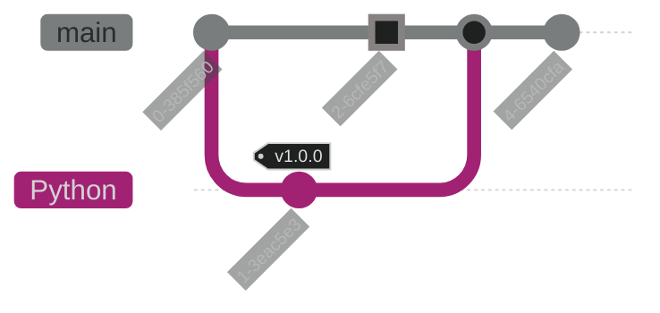

<h3 align="center">Às vezes, o melhor esconderijo é ficar à vista.</h3>

---

<h3 align=right>Languages and Tools</h3>

	

   

---

```mermaid
%%{init: { 'loglevel': 'debug', 'theme': 'dark' } }%%
gitGraph
  commit
  branch Python
  commit tag:"v1.0.0"
  checkout main
  commit type: HIGHLIGHT
  merge Python
  commit
```
